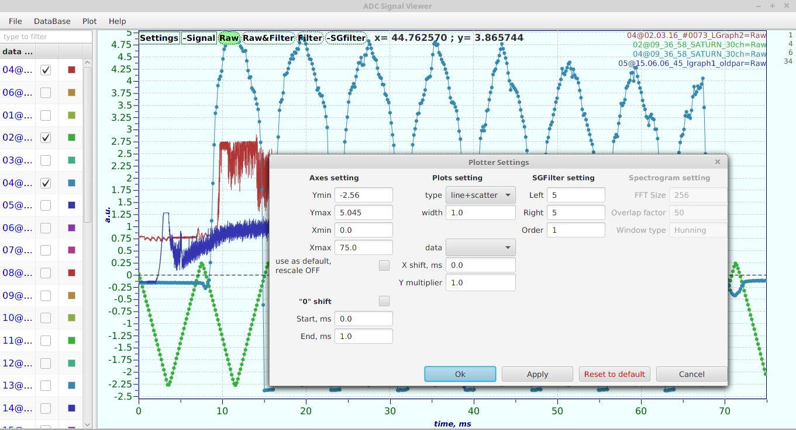
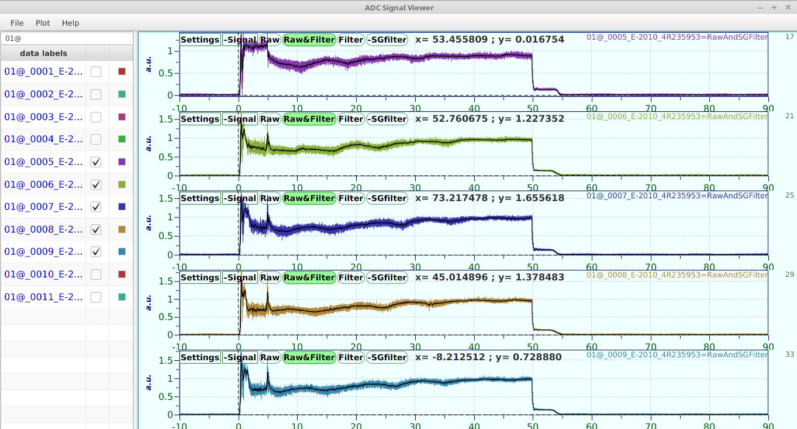
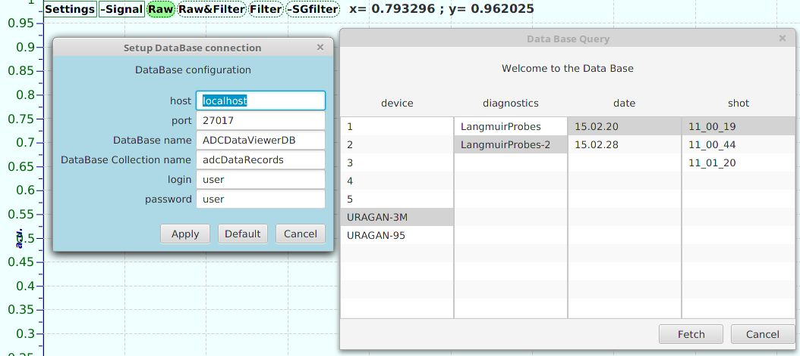

ADCDataViewer
=============

This application allows to visualize binary files created with analog digital converters,
by default these are:

1. L-Card L-783M, http://www.lcard.ru/products/boards/l-783
2. L-Card e20-10, http://www.lcard.ru/products/external/e20-10
3. SATURN SDI-AD12-128H, http://www.saturn-data.com

It is possible to visualize data presented in a text file as well.
For now it should be a single file per one array of registered data:

- (a) single data column inside
- (b) X column in milliseconds, Y data column
 
You will be prompted to enter some data parameters manually in this case
 (choose proper data and time columns, channel number, ADC channel rate...).
 
An information about every signal will be extracted from an appropriate
binary *.par file  in correspondence with a chosen binary *.dat file
(or from the beginning of a chosen *.dat file in case of SATURN SDI-AD12-128H)
This information will be shown in the right part of the program's main window,
according to a selected  table row, when pressing ctrl+H
(mouse-click on a plot to focus)

ADC files examples are included in the "resources/sampledata/" subfolder.

Executable Jar file with data examples are located in a zip file, "resources/executable/" subfolder

Screenshots
------------

Select data from the table to show some data details

and select some positions one by one or all at once to visualize plots
For more convenience the filter above the table can be utilized,
just insert a proper string with part of data label to filter the list

Some interactive plotter settings and Savitsky-Golay filter are available:
line width, move data along X axis, data scaling,
compensation of ADC zero drift

You can view signals one under another

Data base interaction
-------------

Persist your data with MongoDB data base.
You should setup a MongoDB server and make sure that a data base
with appropriate name, collection and authorized user name is available 

Run with Maven:
----------
Java 8:
mvn compile exec:java -Dexec.mainClass=adc.data.viewer.ui.MainApp
Java 11:
mvn compile exec:java -Dexec.mainClass=adc.data.viewer.ui.MainAppJDK11Launcher

How to use:
----------

   - "File->Open"               shows a file chooser dialog, files with "dat", "csv" and "txt"
                                extensions will be available;
                                new data will be added to the existing list
   - "File->Clear"              will clear the list of data in table;                                 
   - "File->Open Auto"          shows a directory chooser dialog to set a directory
                                for watching new files creation by an ADC, by copying, etc.

   - "Plot->Export selected to txt "     converts selected data shown in the main table
                                    to the text format and save it to a subfolder named "<source>/txt"
   - "Plot->Draw"                   shows selected signals;
                                    arrow UP,DOWN - list by one; ctrl+HOME - show all in one;
   - "Plot->Draw by one"            shows selected signals inside one drawing, one under another;
   - "Plot->Draw by one and scroll" shows selected signals one by one inside a scrolling pane;
   - "DataBase->..." setup data base connection, persist and fetch your data;
   
   
   - When plots are shown, Savitsky-Golay filter can be applied.
   - double click on table will check/uncheck all signals
   - individual color can be set for every signal
   - hot keys for menu items;
   - keys "Ctrl+W" when pressed will move panel divider position
     to show/hide data table
   - keys "Shift+S" when pressed will save a profile - Y values
     at a given X coordinate from every data that are plotted
   - keys "Shift+F" when pressed will substitute source Y data with filtered ones
   - keys "Shift+P" when pressed will save a snapshot of plots
   - When using "Plot->Draw" view with all curves on single plot, data curves can be listed with keyboard arrows; "Ctrl+Home" will draw all selected 

In order to hot keys were enabled, the plot should be in focus, just mouse-click on it      

Zoom and pan plots with mouse:
   - zoom: left click + drag from a top left to a bottom right
   - pan: right click + drag 
   - rescale to a full view: left click + drag back from a bottom right to a top left

NOTE: if there are a lot of points, complete drawing will take some time.
      Laptop with Intel i5 renders a 1 000 000 of points about 1 minute,
      in case of drawing all data "as is".
      Feature is included that enables rapid drawing even when there are
      millions of data points. Canvas drawing now successfully
      copes with millions of data points due to simple "point-per-pixel" approach.
      Just use zoom to view all the details.

LICENSING
---------

Copyright (c) 2016 onward, Aleksey Beletskii  <beletskiial@gmail.com>
All rights reserved

github: https://github.com/alekseybeletskii

The ADCDataViewer software serves for visualization and simple processing
of any data recorded with Analog Digital Converters in binary or text form.

Commercial support is available. To find out more contact the author directly.

Redistribution and use in source and binary forms, with or without
modification, are permitted provided that the following conditions are met:

  1. Redistributions of source code must retain the above copyright notice, this
     list of conditions and the following disclaimer.
  2. Redistributions in binary form must reproduce the above copyright notice,
     this list of conditions and the following disclaimer in the documentation
     and/or other materials provided with the distribution.

The software is distributed to You under terms of the GNU General Public
License. This means it is "free software". However, any program, using
ADCDataViewer _MUST_ be the "free software" as well.
See the GNU General Public License for more details
(file ./COPYING in the root of the distribution
or website <http://www.gnu.org/licenses/>)

THIS SOFTWARE IS PROVIDED BY THE COPYRIGHT HOLDERS AND CONTRIBUTORS "AS IS" AND
ANY EXPRESS OR IMPLIED WARRANTIES, INCLUDING, BUT NOT LIMITED TO, THE IMPLIED
WARRANTIES OF MERCHANTABILITY AND FITNESS FOR A PARTICULAR PURPOSE ARE
DISCLAIMED. IN NO EVENT SHALL THE COPYRIGHT OWNER OR CONTRIBUTORS BE LIABLE FOR
ANY DIRECT, INDIRECT, INCIDENTAL, SPECIAL, EXEMPLARY, OR CONSEQUENTIAL DAMAGES
(INCLUDING, BUT NOT LIMITED TO, PROCUREMENT OF SUBSTITUTE GOODS OR SERVICES;
LOSS OF USE, DATA, OR PROFITS; OR BUSINESS INTERRUPTION) HOWEVER CAUSED AND
ON ANY THEORY OF LIABILITY, WHETHER IN CONTRACT, STRICT LIABILITY, OR TORT
(INCLUDING NEGLIGENCE OR OTHERWISE) ARISING IN ANY WAY OUT OF THE USE OF THIS
SOFTWARE, EVEN IF ADVISED OF THE POSSIBILITY OF SUCH DAMAGE.
